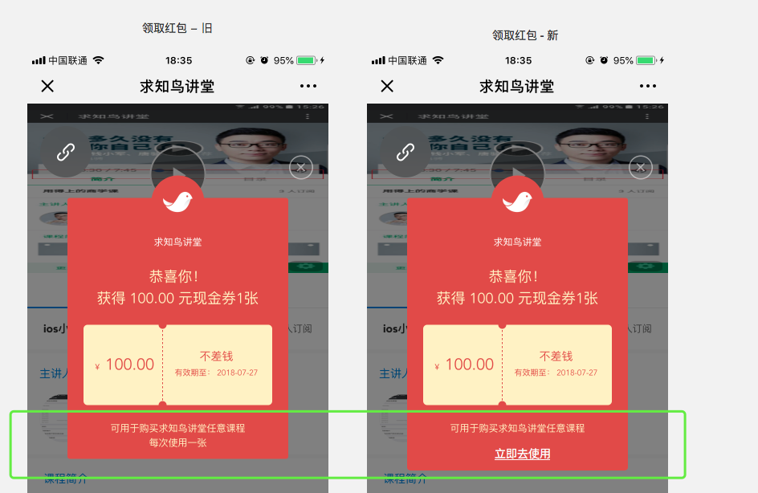

[Toc]

## 1.需求背景
当前新人红包领取需要用户手动进入到课堂H5页面才行。
为了提升转化，把红包入口通过客服消息发送给用户，用户点击即可领取。
## 2. 流程图

>  - H5课堂，不再弹框提醒领取"新人红包"。公众号的新人红包，统一在推送消息中领取。
>  - 其他优惠提醒和小程序中的逻辑不受影响。

## 3. 交互图

`**客服消息**`(图1)：
- 文案为： @{NickName}，有新的优惠券待领取
- 发放时机：关注公众号后的第二日早晨8点

`**领取红包**`(图2)：
- 当用户未领取过新人红包的时候，进入该页面，并自动帮他领取。  
- 按钮点击: 进入到课程主页

`**已领取**`(图3): 
- 当用户已经领取过新人红包的时候，进入图3的页面。
- 按钮点击: 进入到课程主页

## 4. 默认红包模块的优化

优化点:
-  把"每次使用一张"的文案去掉；
- 添加一个"立即去使用"的按钮，用户点击跳到首页。

涉及工作: 
- H5
- 小程序