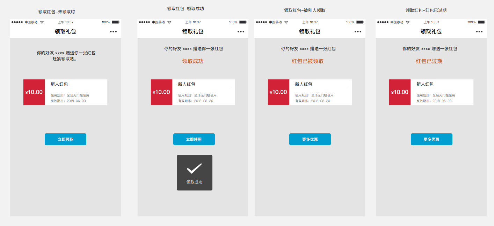

[Toc]

## 1.需求背景
若用户的账户中红包用不完，可以赠送给自己的微信好友，起到裂变的作用。

## 2.流程图

## 3. 交互

### 3.1 发起转增

1. 每个红包中的【立即使用】去掉，在该页面加入一个固定的入口：【立即去使用】。
2. 每个红包中加入一个【转增给好友】的按钮，点击后调起微信的分享接口。
3. 分享出去的小程序卡片内容标题为：你的好友 XXXX 送你一张价值 {n}  元的红包，数量有限，赶紧点击领取。

### 3.2 领取红包



当A送给B一张优惠券，以上是B点击后打开的页面视觉图。

```table
| 状态 | 解释 | 点击按钮处理 | 
| 未领取 | 该优惠券还能被领取并使用 | 去领取优惠券
| 领取成功 | 成功领取改优惠券 |  去到课程主页 |
| 红包已被领取 | 当红包已被自己或其他人领取时 | 去到课程主页 |
| 红包已过期 | 当红包未被领取，并且红包已经过期 | 去到课程主页 |
``` 

### 3.3  转增者，查看领取情况

当A发给其他人一张优惠券，这是A打开看到的视觉。

```table
| 状态 | 解释 | 
| 未领取 | 该优惠券还能被领取并使用 | 
| 红包已被领取 | 当红包已被其他人领取时 | 
| 红包已过期 | 当红包未被领取，并且红包已经过期 | 
``` 