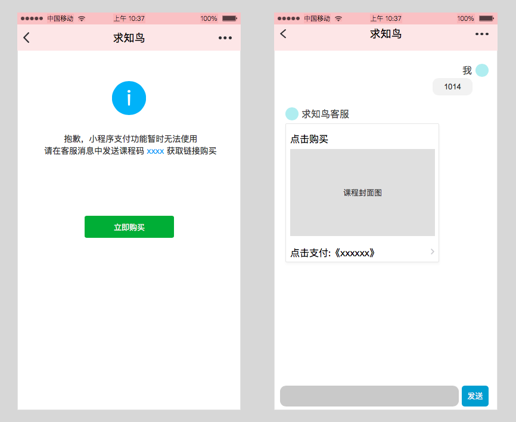

[TOC]

## 1. 需求背景
因苹果公司的政策问题，iOS版的微信小程序支付虚拟商品时，支付接口暂不能用。
>  现在微信也在和苹果交涉当中，后续随时可能出现反转。需要不断跟进最新的消息。


## 2. 支付流程优化
```flow
 st: ▲小程序中点击支付按钮
dialog: 弹窗提醒用户在客服消息中发送课程ID
click: ▲用户点击弹窗的“立即购买”
msg1: 跳到小程序客服界面
repay: ▲用户发送课程ID，自动回复课程购买链接
openURL: ▲点击消息打开对应的H5课程
pay: ▲在H5中支付
end: 支付完成

st > dialog > click > msg1 > repay >  openURL > pay > end
```
在流程图中，▲标志代表用户自己手动操作。

## 3. 交互

> 小程序和H5中，课程详情页从后台到前台时，数据需自动刷新。

### 3.1 提醒弹窗


`- 课程码`：课程都应的ID， 点击该课程码，则Toast提醒 “课程码已复制到剪切板”
`- 触发时机`：当用户点击『立即支付』按钮时，弹窗提醒
`- 点击『立即购买』`：跳到客服界面，并且发送图文消息给用户。

### 3.2 客服发送图文消息
**消息格式**
> [点击查看微信小程序的接口文档](https://developers.weixin.qq.com/miniprogram/dev/api/custommsg/conversation.html)

``` table
| 字段 | 内容 |
| msgtype |  link |
| title | 点击购买《xxxxxx》 |
| description | {课程简介}  |
| url | 购买的课程的 H5 的 URL，URL中的渠道号参数为小程序的渠道号 |
| thumb_url | 课程列表里的图片 | 
```


